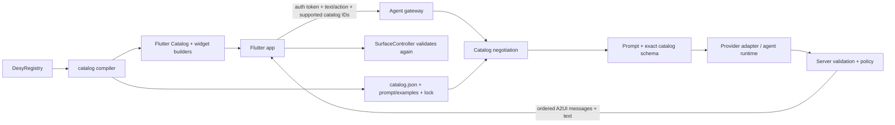

# Flutter GenUI: secure backend and shared catalog architecture

Research date: 2026-08-11  
Upstream snapshot reviewed: `flutter/genui@85671b676282e8fe9e7491fc5bcc08181044de63`

## Executive conclusion

Use A2UI as the versioned contract between Flutter and the backend. Keep Flutter
widget builders in the app, export the matching JSON Schema catalog as a build
artifact for the backend, and run every provider call, tool, policy, retry, and
secret on the server.

GenUI already has the seams needed for this: `Catalog`/`CatalogItem` describe
what Flutter can render, `SurfaceController` validates and renders A2UI, and the
abstract `Transport` plus `A2uiTransportAdapter` allow any remote protocol.
`genui_a2a` is one transport implementation, not a required backend framework.

Desy can credibly become the authoring source for both sides, provided it grows
an optional generative contract and compiler. `DesyRegistry` should remain the
only inventory. A `desy_genui` adapter should derive both the in-app GenUI
catalog and backend JSON artifacts from it; it must not introduce a parallel
catalog.

## 1. What GenUI actually does

GenUI is a renderer/runtime for JSON-defined UI assembled from developer-owned
Flutter widgets. It does not ship arbitrary generated Dart code to the client.
The project is explicitly highly experimental and currently declares A2UI v0.9
support ([GenUI README](https://github.com/flutter/genui/tree/f794e18f1e3f2cc996cbb33f60211379a792f43d)).

The central types are:

- `CatalogItem`: a component name, JSON Schema, Flutter `widgetBuilder`, optional
  example data, and layout hint. It injects the component discriminator into the
  schema ([source](https://github.com/flutter/genui/blob/f794e18f1e3f2cc996cbb33f60211379a792f43d/packages/genui/lib/src/model/catalog_item.dart)).
- `Catalog`: components, client functions, catalog ID, and prompt fragments. It
  can build real Flutter widgets and produce capabilities/full schema
  ([source](https://github.com/flutter/genui/blob/f794e18f1e3f2cc996cbb33f60211379a792f43d/packages/genui/lib/src/model/catalog.dart)).
- `SurfaceController`: receives A2UI operations, validates them against the local
  catalog, maintains surfaces/data, and builds widgets.
- `Conversation`: joins a controller to a transport and sends user actions and
  errors back to the agent.
- `Transport`: the backend boundary. `A2uiTransportAdapter` can accept text and
  decoded A2UI messages from an application-specific connection.

The bundled direct-LLM examples are demonstrations, not the required topology.
The repository itself says custom agent servers should use `genui_a2a`; Verdure
contains a separate Python server and Flutter renderer
([example](https://github.com/flutter/genui/tree/f794e18f1e3f2cc996cbb33f60211379a792f43d/examples/verdure)).

### Important serialization boundary

`Catalog.toCapabilitiesJson()` serializes the catalog ID, component schemas, and
functions. It cannot serialize Flutter builder closures, and it does not carry
all prompt fragments or examples. Therefore the backend cannot discover the
complete production catalog by introspecting a running Flutter app. Both sides
need build outputs derived from the same declaration.

A2UI treats a catalog URI as a stable identifier, not a requirement that the
client dynamically fetch it. Client and agent normally know definitions at
build/deploy time. Clients advertise ordered `supportedCatalogIds`; the server
chooses an intersection, and a surface's catalog is fixed after creation
([A2UI v0.9 specification](https://a2ui.org/specification/v0.9-a2ui/)).

The current GenUI capability model can also inline catalogs, but its own source
notes that negotiation of whether a server accepts inline catalogs is not yet
implemented. For production, accept only server-known catalog IDs. Trusting an
arbitrary client-provided inline schema would let the client expand the model's
allowed UI vocabulary.

## 2. Recommended secure architecture



The mobile/web app contains:

- application authentication credentials, never model-provider credentials;
- the versioned GenUI `Catalog` and real widget builders;
- `SurfaceController`, rendering, local state, and a backend transport;
- defense-in-depth validation and a safe unsupported/invalid-UI fallback.

The backend contains:

- TLS, authentication, tenant/session ownership, rate limits, quotas, timeouts,
  cancellation, and audit/observability;
- provider secrets in a secret manager;
- an exact versioned catalog artifact and prompt/examples;
- the model/agent adapter, tools, authorization, retries, and output validation;
- streaming of only accepted A2UI messages.

The wire protocol should carry at minimum:

- conversation/context ID and monotonic request ID;
- text or user action;
- supported catalog IDs in preference order;
- relevant client data-model state where required;
- ordered text/A2UI events, terminal status, and structured errors.

A2UI itself is transport agnostic. The specification requires ordered framed
messages, metadata for capabilities/data state, and a return channel for
interactive actions; SSE+HTTP, WebSocket, A2A, AG-UI, MCP, or plain REST can all
carry it ([transport contract](https://a2ui.org/specification/v0.9-a2ui/#transport-decoupling)).

### GenUI/A2A integration shape

For a proof of concept, the public classes fit together approximately like this:

```dart
final catalog = buildAcmeCatalog(); // stable, explicit catalogId
final controller = SurfaceController(catalogs: [catalog]);

late final A2uiTransportAdapter transport;
final connector = A2uiAgentConnector(url: backendUri);

transport = A2uiTransportAdapter(
  onSend: (message) => connector.connectAndSend(
    message,
    clientCapabilities: controller.clientCapabilities,
  ),
);

connector.stream.listen(transport.addMessage);
connector.textStream.listen(transport.addChunk);

final conversation = Conversation(
  controller: controller,
  transport: transport,
);
```

No provider key appears in this app. It sends only an application bearer token
or session credential to the application's backend.

Production caveat: current `A2uiAgentConnector` uses HTTP SSE/JSON-RPC. Some
repository prose still says WebSocket. Its internal SSE transport supports auth
headers, but that construction is not cleanly exposed by the package's public
library surface. Do not import `src/` APIs as a long-term contract. Use a small
application-owned `Transport`, or maintain a narrow wrapper/fork until upstream
exposes authenticated transport configuration.

## 3. Backend choices

The catalog and A2UI validator should be framework-independent. This makes the
backend a replaceable experiment rather than coupling the app to one agent SDK.

| Backend | Best fit | Integration work | Recommendation |
|---|---|---|---|
| Python ADK + LiteLLM | Fastest faithful proof; closest to Verdure | Replace its hard-coded/basic schema, add negotiation/auth, harden validation | Start here to prove end-to-end A2A quickly |
| Dart server + Dartantic | One-language team, provider switching, typed tools/outputs | Implement SSE/A2A route and A2UI prompt/validator; keep Flutter-only `genui` off the server | Best Desy co-development lane |
| TypeScript + Flue | Persistent/autonomous agents, Node or Cloudflare deployment | Add an A2UI output/validation adapter and route mapping | Choose when Flue's session/harness features are actually needed |
| Go + ADK/A2A | Operationally lean service, strong concurrency and Go team | Resolve A2A version compatibility or use a custom SSE transport first | Good production candidate after conformance tests |

### Dartantic

Dartantic explicitly supports both client- and server-side Dart, multiple
providers, streaming, tools, typed outputs, and retries
([official docs](https://docs.dartantic.ai/)). On a backend, it can receive the
prompt assembled from `catalog.json`, generate a JSON stream, validate it, and
emit accepted A2UI events.

Do not depend on Flutter's `genui` package in a pure Dart server merely to obtain
`PromptBuilder`. Prefer a language-neutral generated artifact and pure-Dart
schema/A2UI code. This keeps the service deployable without a Flutter runtime.

### Flue

The project the question likely refers to is now documented at
`flueframework.com`. It is a TypeScript agent framework for Node and Cloudflare,
with HTTP routes, streaming, continuing sessions, tools/actions, and sandboxed
agent harnesses ([getting started](https://flueframework.com/docs/getting-started/quickstart/),
[agent routing](https://flueframework.com/docs/guide/building-agents/)). No native
A2UI adapter was found. Implement A2UI as an explicit output contract and
validation stage rather than asking the Flutter app to understand Flue's native
event format.

### Go

The official Go A2A SDK implements A2A v1.0 and supports gRPC, REST, and JSON-RPC
([a2a-go](https://github.com/a2aproject/a2a-go)); Google's Go ADK is a separate
model/deployment-agnostic toolkit ([adk-go](https://github.com/google/adk-go)).
GenUI currently declares A2UI v0.9 and its included A2A client/examples use the
older pre-1.0 A2A family. Do not assume wire compatibility. Either:

1. first implement the simple application-owned SSE/HTTP transport; or
2. build an explicit compatibility adapter and verify it with captured fixtures
   and the relevant A2A conformance suite.

### Multiple backend experiments

Put provider/runtime selection behind the gateway, not in Flutter. The client
targets one application protocol. A feature flag or tenant configuration chooses
`dartantic`, `python-adk`, `flue`, or `go-adk`. Run the same golden conversations
through each and compare:

- schema-valid response rate before retry;
- time to first text and first renderable surface;
- full response latency and token cost;
- invalid tree/action rate;
- task success and human correction rate.

## 4. What a shared catalog must contain

A useful catalog is more than a widget list. It is a bidirectional, executable
contract with four layers:

1. **Identity and compatibility**: stable catalog URI, semantic version,
   protocol version, content digest, dependencies, supported client range.
2. **Model-facing schema**: component discriminator, typed properties,
   required/default/enum/range constraints, descriptions, examples, children,
   bindings, events/actions, and registered client functions.
3. **Flutter implementation**: a decoder plus builder that maps valid values to
   the consumer's real themed widget; safe fallbacks for invalid/unknown input.
4. **Operational artifacts**: prompt guidance, examples/goldens, validation
   schema, compatibility lock, and conformance fixtures.

A2UI custom catalogs should preserve the canonical `ComponentId` and
`ChildList` wire shapes for structural fields. GenUI's current public helper
for a single child emits a string schema, while its multi-child helper expands
the `ChildList` shape; section 8 pins those exact current APIs. Backend
validation should additionally verify that referenced child IDs exist
([validator rules](https://a2ui.org/specification/v0.9-a2ui/#validator-compliance-when-defining-catalogs)).

Recommended generated outputs:

```text
generated/genui/
  catalog.json          # standalone A2UI custom catalog for server validation
  catalog.prompt.md     # concise usage/selection guidance
  catalog.examples.jsonl
  catalog.lock.json     # catalogId, version, A2UI version, digest
```

The URI can look like
`https://design.example/a2ui/catalogs/acme/v1/catalog.json`. It is the identity;
serving a readable copy there is useful but runtime fetching should not be the
source of truth.

## 5. Can Desy deliver this?

Yes, with an optional compiler/extension and richer typed contracts. This fits
Desy's principles—consumer ownership, real widgets, one registry, semantic
contracts, typed extension points—better than maintaining hand-written client
and backend catalogs.

Current Desy is a strong starting point:

- `DesyRegistry` already owns stable component IDs, themes, typed atom lanes,
  components, showcases, and prototypes.
- `DesyComponent` already builds the real widget from knob values and can carry
  instances, scenarios, slots, and a human-facing contract.
- `DesyCatalogueExport` already produces JSON-ready metadata and explicitly
  identifies GenUI as a possible consumer.

But today's export is not yet an A2UI catalog. Its schema is experimental and
omits several executable constraints: catalog identity/version/digest, full JSON
Schema types and required/default/enum rules, A2UI child-reference semantics,
data binding, events/actions, registered functions, builder codecs, prompt
examples, and protocol validation. Existing contract property types and slot
acceptance are descriptive strings, not enforceable JSON Schema.

### Proposed Desy shape

```text
DesyRegistry (only inventory/source of truth)
  └─ optional typed generative metadata per eligible DesyComponent
       └─ desy_genui compiler/extension
            ├─ Flutter CatalogItem builders -> real consumer widgets
            ├─ backend catalog.json
            ├─ prompt/examples/lock artifacts
            └─ schema + render conformance tests
```

The adapter may traverse and transform the registry but must not own another
list of components. Keep A2UI-specific types out of the reusable core where
possible: define protocol-neutral property/slot/action metadata in
`desy_bench`, then translate it in an optional `desy_genui` package.

An incremental path:

1. **POC**: export eligible components with string/boolean knobs and explicit
   stable IDs; combine them with a very small structural layout catalog.
2. **Typed properties**: numbers, enums, lists/objects, defaults, constraints,
   semantic descriptions, codecs, and examples.
3. **Composition**: explicit single-child/child-list slots mapped to A2UI
   references; reject illegal structures at build time and runtime.
4. **Interaction**: declared local/server actions, client functions, binding
   modes, argument/result schemas, and authorization labels.
5. **Release discipline**: deterministic artifacts, content hashes, schema
   snapshots, generated-message validation, real-widget render tests, and
   compatibility rules for additive versus breaking changes.

Do not expose every design token to the model. Component builders should
encapsulate the visual system. Expose only semantic choices such as `tone`,
`emphasis`, or approved variants when these are legitimate product-authoring
decisions. This produces more consistent UI and a much smaller model search
space.

Desy's current local-first first-release boundary means this should begin as an
experimental optional extension, not an account/backend feature in Desy core.
The catalog compiler can still be local and repository-native: CI generates and
publishes artifacts; the consuming application decides where its agent runs.

## 6. Security and correctness gates

Model output is untrusted remote content. A2UI v0.9 is prompt-first and the
specification explicitly requires robust post-generation validation and repair
([prompt-first rationale](https://a2ui.org/specification/v0.9-a2ui/#changes-from-previous-versions)).

Before production:

- negotiate only allowlisted catalog IDs and reject catalog mismatches;
- validate every server message against the exact envelope + catalog schema;
- validate tree integrity, unique IDs, root presence, ordering, depth, component
  count, text size, and aggregate payload size;
- allowlist schemes/domains for images and links; proxy assets where SSRF or
  tracking is a concern;
- separate UI actions from privileged tools. An action name is a request, not
  authorization; re-check actor, tenant, object, and operation server-side;
- use idempotency keys for mutating operations and confirmation for destructive
  or costly actions;
- retry/correct invalid model output at most a bounded number of times, then
  return safe text/error UI;
- validate again in Flutter and never execute generated code;
- redact secrets/PII from prompts and logs; define retention and deletion;
- test cancellation, reconnect/replay, duplicate events, stale contexts, and
  catalog rollout/rollback.

## 7. Recommended first implementation

Build one vertical slice before choosing the final backend framework:

1. Select 5–8 Desy components: text, card, button, one input, one status/result,
   plus two structural components.
2. Define a versioned catalog ID and generate `catalog.json`, prompt guidance,
   examples, lock digest, and the Flutter `Catalog` from `DesyRegistry`.
3. Start with the Verdure-shaped Python server to prove A2A/GenUI behavior, or a
   Dartantic server with an application-owned SSE transport if Dart end-to-end
   is the higher-value experiment.
4. Add bearer auth and capabilities negotiation immediately; keep all provider
   keys server-side.
5. Create golden protocol fixtures and run them against Flutter rendering and
   backend validation.
6. Plug a second backend behind the identical fixture suite. Choose based on
   reliability, latency, operational fit, and team ownership—not demo brevity.

The most direct Desy-oriented choice is Dartantic + custom SSE for the first
compiler POC. The fastest upstream-aligned interoperability proof is the Python
Verdure route. Flue and Go become meaningful once the catalog contract and
fixtures are stable.

## 8. Current GenUI API refresh (2026-08-11)

This section pins the APIs needed by the first Desy adapter and local sample to
`flutter/genui@85671b676282e8fe9e7491fc5bcc08181044de63`, the `main` head at
the time of this refresh. That commit only adds the placeholder `a2ui_agent`
package; the GenUI implementation is unchanged from the earlier `f794e18`
snapshot. GenUI remains explicitly experimental, so the adapter should isolate
these imports in its own optional package and record this upstream SHA in tests
and release notes ([snapshot](https://github.com/flutter/genui/tree/85671b676282e8fe9e7491fc5bcc08181044de63)).

### Exact dependency floor

At this snapshot, the package manifests declare:

- `genui: 0.10.1`, Dart `>=3.10.0 <4.0.0`, Flutter `>=3.35.7`, with
  `a2ui_core: ^0.1.0` and `json_schema_builder: ^0.1.3`
  ([GenUI manifest](https://github.com/flutter/genui/blob/85671b676282e8fe9e7491fc5bcc08181044de63/packages/genui/pubspec.yaml#L5-L28));
- `a2ui_core: 0.1.0`, Dart `>=3.10.0 <4.0.0`
  ([core manifest](https://github.com/flutter/genui/blob/85671b676282e8fe9e7491fc5bcc08181044de63/packages/a2ui_core/pubspec.yaml#L5-L19)).

The adapter package therefore needs `genui: ^0.10.1` and
`json_schema_builder: ^0.1.3`. A sample that constructs typed local A2UI
messages also needs a direct `a2ui_core: ^0.1.0` dependency: GenUI consumes
those public core message types but does not re-export the `a2ui_core` library.
No LLM, `Conversation`, transport, or `genui_a2a` dependency is needed for the
local catalog sample.

### Constructors and builder contract

The current constructors are:

```dart
Catalog(
  Iterable<CatalogItem> items, {
  Iterable<ClientFunction> functions = const [],
  String? catalogId,
  List<String> systemPromptFragments = const [],
});

CatalogItem({
  required String name,
  required Schema dataSchema,
  required Widget Function(CatalogItemContext) widgetBuilder,
  List<String Function()> exampleData = const [],
  bool isImplicitlyFlexible = false,
});
```

These signatures are defined in the current
[`Catalog`](https://github.com/flutter/genui/blob/85671b676282e8fe9e7491fc5bcc08181044de63/packages/genui/lib/src/model/catalog.dart#L32-L58)
and
[`CatalogItem`](https://github.com/flutter/genui/blob/85671b676282e8fe9e7491fc5bcc08181044de63/packages/genui/lib/src/model/catalog_item.dart#L82-L151)
sources. A `CatalogItem` schema describes only component-specific properties.
GenUI injects the `component` discriminator from `name`; supplied
`component` schema data is overwritten. The runtime `id` and `component`
fields are removed before the properties map reaches `itemContext.data`
([schema injection](https://github.com/flutter/genui/blob/85671b676282e8fe9e7491fc5bcc08181044de63/packages/genui/lib/src/model/catalog_item.dart#L99-L126),
[component decoding](https://github.com/flutter/genui/blob/85671b676282e8fe9e7491fc5bcc08181044de63/packages/genui/lib/src/model/ui_models.dart#L215-L240)).

`CatalogItemContext` is the complete bridge the Desy builder needs. In
particular it provides the component properties, Flutter `BuildContext`,
`buildChild(id)`, `dispatchEvent`, the surface/data contexts, catalog/component
lookups, and error reporting
([context API](https://github.com/flutter/genui/blob/85671b676282e8fe9e7491fc5bcc08181044de63/packages/genui/lib/src/model/catalog_item.dart#L28-L79)).
The adapter should translate `itemContext.data` to Desy knob values and invoke
the existing `DesyComponent` builder; it should not reconstruct consumer
widgets or maintain another component inventory.

`exampleData` is a list of callbacks returning JSON strings. Each string is a
flat component list and must contain an item whose `id` is `root`. Named Desy
instances map naturally to these examples, provided child instances are
expanded into the same flat list rather than nested JSON.

### Current schema conventions

Use the public `A2uiSchemas` helpers where the adapter supports their full
runtime shape:

- literal scalar knobs: `S.string`, `S.number`, and `S.boolean`; do not use the
  dynamic-reference helpers while Desy binding support remains deferred;
- a single child: `A2uiSchemas.componentReference()`, whose current
  implementation is a string schema;
- multiple children: `A2uiSchemas.componentArrayReference()`, which accepts
  either `List<String>` IDs or `{componentId, path}` template data;
- an event knob: `A2uiSchemas.action()`, a reference to the canonical A2UI
  `Action` definition.

The exact helper implementations are in
[`a2ui_schemas.dart`](https://github.com/flutter/genui/blob/85671b676282e8fe9e7491fc5bcc08181044de63/packages/genui/lib/src/model/a2ui_schemas.dart#L292-L381).
The bundled `Column` demonstrates the multi-child schema and runtime handling
([source](https://github.com/flutter/genui/blob/85671b676282e8fe9e7491fc5bcc08181044de63/packages/genui/lib/src/catalog/basic_catalog_widgets/column.dart#L17-L55));
the bundled `Button` demonstrates a single child plus an action
([source](https://github.com/flutter/genui/blob/85671b676282e8fe9e7491fc5bcc08181044de63/packages/genui/lib/src/catalog/basic_catalog_widgets/button.dart#L19-L58)).

There is an important implementation choice for Desy's first release. The
multi-child helper advertises both an explicit list and a data-bound template.
If the adapter only implements the agreed literal composition surface, its
generated schema should accept only a list of component ID strings. Advertising
`componentArrayReference()` while rejecting its template branch would make the
catalog dishonest. Switch to the full helper when binding/template expansion is
implemented.

The A2UI action wire value is not a callback. It is JSON in one of these forms:

```json
{"event":{"name":"submit","context":{"kind":"primary"}}}
{"functionCall":{"call":"someClientFunction","args":{}}}
```

For the agreed Desy event knob, the first form is the relevant one. The builder
reads the event `name`, resolves an optional `context` with the public
`resolveContext(itemContext.dataContext, context)` helper, and calls
`itemContext.dispatchEvent(UserActionEvent(...))`. This is exactly how the
official Button implements server events
([dispatch implementation](https://github.com/flutter/genui/blob/85671b676282e8fe9e7491fc5bcc08181044de63/packages/genui/lib/src/catalog/basic_catalog_widgets/button.dart#L201-L221),
[context resolver](https://github.com/flutter/genui/blob/85671b676282e8fe9e7491fc5bcc08181044de63/packages/genui/lib/src/model/data_model.dart#L178-L192)).
There is no generic action-decoding helper on `CatalogItemContext`; the Desy
adapter must own this small translation.

### SurfaceController and a backend-free sample

The current controller constructor and public APIs needed by the sample are:

```dart
final controller = SurfaceController(
  catalogs: [catalog],
  // pendingUpdateTimeout defaults to one minute.
);

controller.handleMessage(message);
controller.contextFor(surfaceId);
controller.surfaceUpdates;
controller.activeSurfaceIds;
controller.onSubmit;
controller.clientCapabilities;
controller.dispose();
```

The constructor, streams, lookup, capabilities, and message sink are shown in
the official
[`SurfaceController`](https://github.com/flutter/genui/blob/85671b676282e8fe9e7491fc5bcc08181044de63/packages/genui/lib/src/engine/surface_controller.dart#L33-L131)
source. `SurfaceController.handleMessage` accepts
`a2ui_core.A2uiMessage`, so deterministic local fixture messages can drive the
same validation, surface state, and rendering path as future backend messages.

The minimum backend-free flow is:

```dart
import 'package:a2ui_core/a2ui_core.dart' as a2ui;
import 'package:genui/genui.dart';

const surfaceId = 'local-demo';

late final Catalog catalog = buildDesyGenUiCatalog(registry);
late final SurfaceController controller = SurfaceController(
  catalogs: [catalog],
);

void loadFixture() {
  controller.handleMessage(
    a2ui.CreateSurfaceMessage(
      surfaceId: surfaceId,
      catalogId: catalog.catalogId!,
    ),
  );
  controller.handleMessage(
    a2ui.UpdateComponentsMessage(
      surfaceId: surfaceId,
      components: const [
        {
          'id': 'root',
          'component': 'example.card',
          'title': 'Rendered from the Desy catalog',
          'child': 'body',
        },
        {
          'id': 'body',
          'component': 'example.text',
          'value': 'No model or backend was involved.',
        },
      ],
    ),
  );
}

Widget buildSurface() => Surface(
  surfaceContext: controller.contextFor(surfaceId),
);
```

The typed message constructors and their default A2UI `v0.9` envelopes are
defined in
[`a2ui_core/messages.dart`](https://github.com/flutter/genui/blob/85671b676282e8fe9e7491fc5bcc08181044de63/packages/a2ui_core/lib/src/core/messages.dart#L7-L174).
Decoded JSON fixtures can instead use `a2ui.A2uiMessage.fromJson(...)`. A
surface is rendered with `Surface(surfaceContext:
controller.contextFor(surfaceId))`; `Surface` watches the definition, requires
the flat list to contain `id: root`, then recursively resolves child IDs through
the selected catalog
([renderer](https://github.com/flutter/genui/blob/85671b676282e8fe9e7491fc5bcc08181044de63/packages/genui/lib/src/widgets/surface.dart#L20-L130)).

Create-before-update is clearest for a hand-authored fixture. The controller can
also buffer updates received before `createSurface`, which is why GenUI's own
`DebugCatalogView` deliberately sends examples in the opposite order
([official local example](https://github.com/flutter/genui/blob/85671b676282e8fe9e7491fc5bcc08181044de63/packages/genui/lib/src/development_utilities/catalog_view.dart#L46-L128)).

For a sample with interactive Desy event knobs, listen to
`controller.onSubmit`. A dispatched `UserActionEvent` becomes a `ChatMessage`
whose UI interaction part contains `{"version":"v0.9","action":...}`; the
local sample may display or log it instead of forwarding it
([controller event path](https://github.com/flutter/genui/blob/85671b676282e8fe9e7491fc5bcc08181044de63/packages/genui/lib/src/engine/surface_controller.dart#L348-L361)).
This exercises the real bidirectional catalog contract without adding the
backend prematurely.

### Adapter consequences for the current Desy implementation

The smallest faithful compiler for the APIs above is:

1. Require `DesyRegistry.catalogConfig`; use its stable ID as
   `Catalog.catalogId` and its description as a prompt fragment.
2. Traverse eligible registry components directly and emit exactly one
   `CatalogItem` per component. Use the stable Desy component ID as the GenUI
   `name` so A2UI discriminators remain durable.
3. Compile string/number/boolean knob constraints into literal JSON Schema;
   compile single/multi widget-instance knobs into child-ID properties; compile
   event knobs into `A2uiSchemas.action()`.
4. In each `widgetBuilder`, decode only `itemContext.data`, resolve child IDs
   with `itemContext.buildChild`, bridge action JSON to `UserActionEvent`, and
   invoke the registered real Desy widget builder under the consumer theme.
5. Expand named instances to flat, rooted `exampleData` fixtures. Keep all of
   this derived from the one `DesyRegistry`; do not add an adapter-owned
   inventory.

The backend-free sample should prove all five lanes with at least one composite
surface, one multi-child component, and one event. It should use local typed
A2UI messages, not bypass GenUI by calling the Desy builder directly. That
provides a meaningful conformance fixture for the later backend transport.
